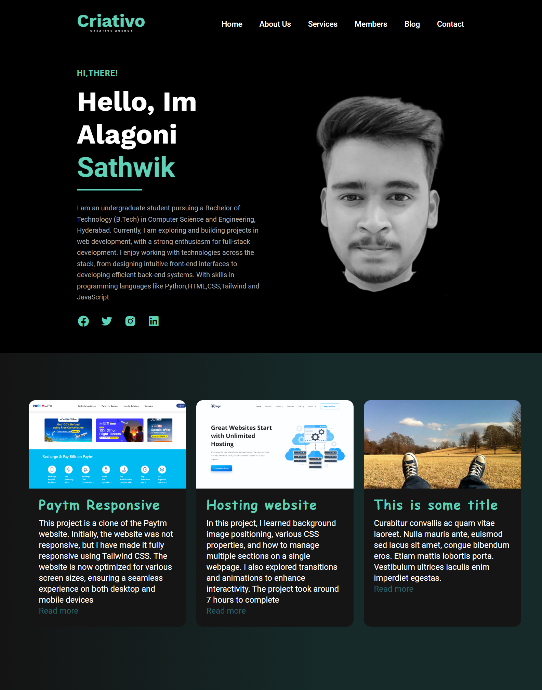

# Sathwik's Portfolio

Welcome to my personal portfolio! Here, you can explore some of my projects and get to know the skills I use in web development.

**Created by Sathwik**

[Portfolio website - Live Demo](https://hosting-landing-pagee.netlify.app/)

---

### **Project Overview**
A clean and professional hosting landing page built with modern web technologies. The page is designed to be visually appealing and responsive across devices, offering a smooth user experience.

---

### **What I Learned**
- **Background Image Positioning**: Gained experience in effective background positioning and layout strategies.
- **Advanced CSS Properties**: Enhanced skills in using complex CSS properties to improve page aesthetics.
- **Managing Sections**: Learned to efficiently manage and organize content across multiple sections on a single page.
- **Transitions & Animations**: Integrated dynamic animations and transitions for enhanced user interaction.

---

### **Project Duration**
This project took **3 hours** to complete.

---

### **Technologies & Tools**
- **HTML5**
- **CSS3**
- **Font Awesome**
- **Google Fonts**
- **Netlify** (for Deployment)
- **Git** (Version Control)

---

### **Connect with Me**

I’d love to connect with you! Feel free to reach out to me through the following links:

- [LinkedIn](https://www.linkedin.com/in/sathwik-alagoni-056b692a0/)
- [GitHub](https://github.com/Sathwik-Alagoni)

---

Feel free to explore more of my projects, and let’s connect if you're interested in collaborating or learning more about my work!
